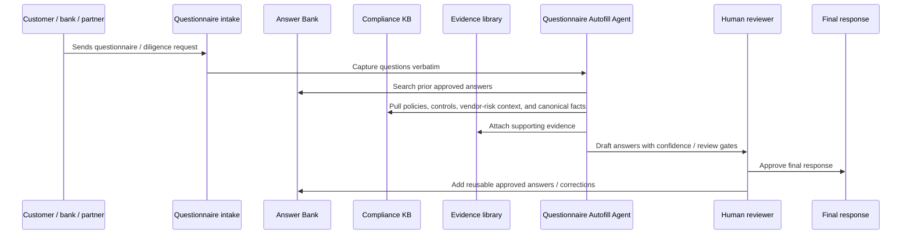
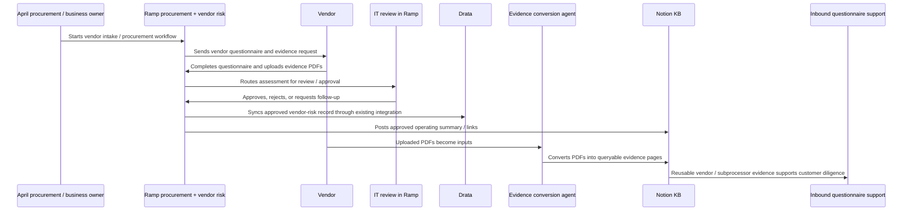
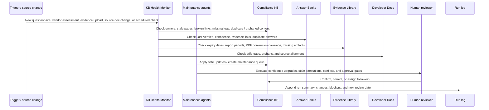
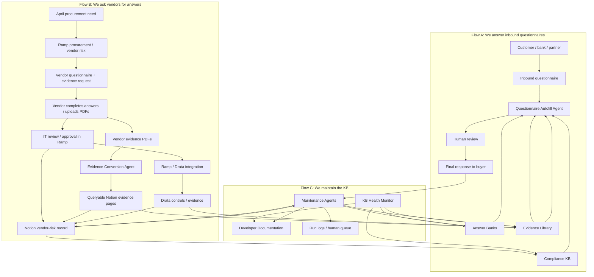
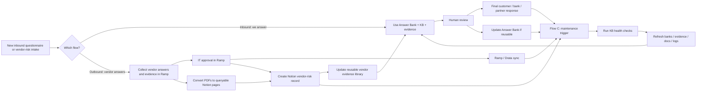

# Compliance Agent Ecosystem & Knowledge Base Operations

> Copied from Notion (april workspace) — source: https://app.notion.com/p/39d992e46de0809e9e1af3c5c2aa58b3
> Parent: The april Almanac. Snapshot as of 2026-07-30.

### Purpose

Create a practical operating map for the **Skills** in this Compliance Knowledge Base and the agents they support, with a clear separation between three different but connected flows:

1. **Inbound / customer diligence:** customers, banks, partners, or vendors buying April's services send us questionnaires to answer.
2. **Outbound / vendor diligence:** April asks vendors we plan to work with to complete questionnaires and provide evidence, so we can support our own vendor-risk program and reuse that evidence when customers ask about our vendors / subprocessors.
3. **Knowledge base maintenance:** April continuously refreshes the KB, Answer Banks, evidence library, Developer Documentation, and run logs so agents can safely reuse the information.

The goal is to keep the flows connected without conflating them.

---

## General gist

There are three related but distinct operating systems:

### Flow A — We answer questionnaires from customers / banks / partners

This is the existing **Vendor Risk Questionnaire Skill** flow.

- A customer, bank, partner, or enterprise buyer sends April a security / privacy / vendor-risk questionnaire.
- April answers using the Answer Bank, Compliance KB, evidence library, and approved language.
- The output is a reviewed questionnaire response, evidence package, and reusable answer-bank updates.
- This flow proves **April's** security, compliance, privacy, operational, and vendor-management posture to buyers of April's services.

### Flow B — We ask our vendors to complete questionnaires

This is the Ramp / procurement / vendor-risk flow.

- April sends questionnaires to vendors we plan to work with.
- Vendors complete the questionnaire and provide evidence.
- IT reviews and approves the risk assessment inside Ramp as part of procurement.
- Ramp and Drata sync through their existing integration.
- Notion stores the operating knowledge record: approved summaries, vendor evidence converted into queryable pages, links to Ramp / Drata, renewal notes, and reusable vendor-risk context.

### Why the two flows connect

Flow B creates source evidence that strengthens Flow A.

If customers ask April about vendor risk, subprocessors, data handling, SOC reports, vendor oversight, or evidence supporting our third-party risk program, we need a reliable way to point back to:

- vendor questionnaire responses,
- vendor SOC / security evidence,
- IT approval decisions,
- Drata control records,
- and Notion summaries that are queryable and reusable.

In short: **we answer external diligence using our KB; we improve that KB by asking our own vendors for structured answers and evidence.**

### Flow C — We maintain the knowledge base

This is the operating layer that keeps Flow A and Flow B usable.

- The KB is not static. Every questionnaire, vendor review, evidence upload, source-doc change, and approved answer can create maintenance work.
- The maintenance flow verifies canonical answers, downgrades stale claims, converts evidence into queryable pages, checks links / owners / review dates, syncs source documentation, and logs runs.
- This flow prevents agents from reusing stale, uncited, ownerless, or unapproved information.
- The output is a healthier knowledge base: current Answer Banks, queryable evidence, source-backed KB pages, clean run logs, and a short human review queue.

In short: **Flow C is the control loop that keeps the KB trustworthy enough for Flow A and Flow B to operate.**

---

## Flow A: inbound questionnaires we answer

### Agents / skills for Flow A

| Operational agent | Powered by | Job to be done | Allowed actions | Not allowed without confirmation |
| --- | --- | --- | --- | --- |
| Questionnaire Autofill Agent | | Draft answers to inbound questionnaires using approved KB knowledge | Search the Answer Bank and KB, score matches, draft answers, create review-state tables, flag uncertainty | Submit externally, mark inferred answers as confirmed, resolve always-ask gates, load final rows before review |
| Questionnaire Maintenance & Gap Agent | [page](https://app.notion.com/p/39d992e46de0814e9cd4f85116b39826) | Keep canonical answers current and safe to reuse, and after each run surface the policy and evidence gaps it exposed | Identify stale rows, downgrade confidence, stamp Last Verified against a named source, correct Attestation Keys, flag missing evidence, merge exact duplicates, propose new and corrected bank rows | Raise confidence to Confirmed, create a new row, change attested answer substance, merge rows whose answers differ, delete rows, write a policy |
| Questionnaire Intake / Page Builder Agent | [page](https://app.notion.com/p/387992e46de080c6ba30f78521466af1) | Turn raw inbound questionnaires into the standard KB page structure | Create structured page sections, capture questions verbatim, add reviewer columns, list documents and evidence needs | Finalize answers, remove reviewer columns, or treat a page as submitted without human approval |

---

## Flow B: vendor questionnaires we send out

### Systems and ownership for Flow B

| System / team | Role | Owns | Does not own |
| --- | --- | --- | --- |
| Ramp | Procurement workflow, vendor questionnaire collection, and vendor-risk assessment workflow | Vendor profile, questionnaire completion status, uploaded diligence artifacts, risk assessment output, IT approval workflow | Notion knowledge curation or broader reusable compliance context |
| Vendor | Provides answers and evidence | Completed questionnaire, SOC reports, security documentation, policy evidence, subprocessors / data-handling information | April's risk decision, April's customer-facing answer language, Drata controls |
| IT | Risk review and approval inside Ramp | Security / IT review decision, approval conditions, required follow-up, technical risk acceptance, approval status in procurement workflow | Finance ownership of vendor relationship, KB taxonomy, or rewriting compliance evidence |
| Ramp / Drata integration | Existing system integration | Syncing approved vendor-risk records and relevant evidence / status from Ramp to Drata | Agent decision-making, risk approval, or Notion knowledge curation |
| Drata | Compliance-control and audit evidence system | Control evidence, vendor-risk compliance record, audit-facing status, control mappings | Operational narrative, reusable diligence context, questionnaire answer-bank content |
| Notion | Operating knowledge layer | Approved assessment summary, queryable evidence pages converted from PDFs, vendor-risk notes, renewal / follow-up context, links to Ramp / Drata, reusable KB learnings | Formal risk approval or compliance-control system of record when Ramp / Drata own that record |

### Agents / operating layers for Flow B

| Operating layer | Status | Job to be done | Allowed actions | Not allowed without confirmation |
| --- | --- | --- | --- | --- |
| Ramp Vendor Risk Intake Tracker | Needed | Track the Ramp procurement / vendor-risk workflow where vendors complete questionnaires and IT reviews / approves | Track vendor questionnaire status, summarize Ramp outputs, identify missing diligence artifacts, prepare the Notion operating record after approval | Approve vendor risk, override IT decision, bypass Ramp procurement workflow, or represent an assessment as complete before IT approval in Ramp |
| Evidence Conversion Agent | [page](https://app.notion.com/p/39e992e46de08162ae61c444d99dbcba) | Convert evidence-related PDFs — including April evidence such as our SOC 2 report and vendor evidence such as a vendor SOC 2 report — into queryable Notion pages | Extract PDF contents into structured Notion pages, summarize evidence, tag source / vendor / artifact type / dates, link back to the relevant evidence record, Ramp / Drata / vendor record where applicable | Alter source PDFs, represent evidence as current without verification, or make risk / compliance conclusions from evidence alone |

---

## How Flow B supports Flow A

| Vendor-sourced artifact | Captured through | Converted / stored in | Used later for |
| --- | --- | --- | --- |
| Vendor questionnaire answers | Ramp vendor-risk workflow | Notion vendor-risk record and Drata record | Answering customer questions about vendor oversight, subprocessors, and third-party risk |
| Vendor SOC reports / security PDFs | Ramp upload | Queryable Notion evidence pages | Supporting evidence packages and internal answer-bank verification |
| IT approval decision | Ramp review workflow | Ramp approval state, Drata sync, Notion operating summary | Showing that vendor risk was reviewed and approved |
| Drata vendor / control record | Ramp / Drata integration | Drata, linked from Notion | Audit readiness and control evidence |
| Renewal / reassessment dates | Ramp / Drata / Notion summary | Notion operating record | KB health checks and stale-evidence monitoring |

---

## Flow C: knowledge base maintenance

### Agents / operating layers for Flow C

| Operating layer | Status | Job to be done | Allowed actions | Not allowed without confirmation |
| --- | --- | --- | --- | --- |
| KB Health Monitor Agent | [page](https://app.notion.com/p/39e992e46de0813ba819e1222ecad88c) | Continuously check whether the Compliance KB is healthy enough for agents to rely on | Flag stale pages, missing owners, broken links, missing review dates, missing change logs, duplicate pages, orphaned docs, and skills with no recent run log | Delete pages, mark content approved, broaden access, or rewrite compliance positions |
| Questionnaire Maintenance & Gap Agent | [page](https://app.notion.com/p/39d992e46de0814e9cd4f85116b39826) | **Verify pass:** keep the Master Answer Bank current, verified, and evidence-backed. **Gap pass:** after each questionnaire, find where the underlying policy or evidence does not exist at all, and name the fix and owner | Lower confidence, stamp Last Verified against a named source, flag stale attestations, correct Attestation Keys, identify missing evidence, merge exact duplicates, repair evidence links, produce a prioritized remediation backlog, propose new and corrected bank rows for approval | Raise confidence to Confirmed, create a new row, change answer substance, resolve conflicting answers without review, delete rows, create or rewrite a policy, mark evidence as existing or current, contact a customer |
| Evidence Conversion Agent | [page](https://app.notion.com/p/39e992e46de08162ae61c444d99dbcba) | Convert evidence PDFs to queryable Notion pages and keep April and vendor evidence current, queryable, and linked to the answers it supports | Convert PDFs to Notion pages, track expiry dates, flag missing or stale evidence, map evidence to answers / vendors / controls | Alter source PDFs, represent stale evidence as current, replace approved evidence, or make compliance conclusions from evidence alone |
| Developer Docs Sync Agent | [page](https://app.notion.com/p/39d992e46de081b6b138f90db771dd6e) | Keep Developer Documentation pages aligned to source docs | Diff source docs, apply factual mirror updates, flag gaps / orphans, append sync logs | Create new pages, restructure pages, edit internal-only callouts, or resolve meaning-level conflicts silently |
| Agent Run Log / Control Agent | [page](https://app.notion.com/p/39e992e46de081fea2c2d2a017305a09) | Maintain operating history for every agent / skill run | Append run summaries, pages checked, pages updated, human queue, unresolved blockers, and next review date | Close a run with unresolved approval gates or missing evidence |

> 🔀 **Merged 2026-07-30.** The Questionnaire Gap & Enrichment Monitor Agent is retired as a separate agent and is now the **Gap pass** of the Questionnaire Maintenance & Gap Agent. The split was drawn on permissions (one could only recommend, the other could write), but you find substance gaps by opening the evidence, and opening the evidence is how you verify a bank row. It is the same work, so it is one agent, one report, one queue. The [old page](https://app.notion.com/p/39e992e46de081398f7def3113278a76) is a pointer stub.
>
> The merge added one capability: the agent may now **propose** new Master Answer Bank rows and answer corrections in its report. It still may not create them itself, and a proposed row is never created as Confirmed.

### What Flow C maintains

| KB area | Maintenance action | Why it matters |
| --- | --- | --- |
| Master Answer Bank | Verify Last Verified, evidence links, confidence, duplicate questions, and stale attestations | Prevents inbound questionnaire agents from reusing outdated or unsupported answers |
| Questionnaire Answer Bank | Preserve submission history and route approved reusable answers into the master layer | Keeps provenance without treating old submissions as automatically current |
| Evidence Library | Convert PDFs into queryable Notion pages, track expiry / report periods, and link evidence to supported answers | Makes evidence discoverable for both customer diligence and internal vendor oversight |
| Vendor-risk records | Keep Ramp / Drata / Notion links, IT approval, renewal dates, and reusable vendor-risk notes current | Ensures outbound vendor diligence can support future customer-facing answers |
| Developer Documentation | Sync Notion docs from source docs and flag gaps / orphans | Keeps technical KB content accurate without manually rewriting public-source docs |
| Skill / agent pages | Check instructions, allowed actions, human gates, run logs, and owner assignments | Prevents agent workflows from drifting or acting beyond their approved scope |

---

## Unified architecture

---

## Notion record after vendor approval in Ramp

Each approved vendor risk assessment should create or update a Notion record with:

- **Vendor**
- **Business owner**
- **System / service description**
- **Ramp assessment link**
- **Vendor questionnaire status**
- **Ramp risk rating / assessment outcome**
- **IT reviewer**
- **IT approval decision**
- **Approval date**
- **Conditions / required follow-ups**
- **Drata record / control link**
- **Evidence PDFs uploaded by vendor**
- **Queryable Notion evidence pages converted from PDFs**
- **Renewal / reassessment date**
- **Residual risk notes**
- **Which customer-facing answers this supports**
- **Open blockers**

---

## Dependency map

| Dependency | Used by | Why it matters | Health check |
| --- | --- | --- | --- |
| Master Answer Bank | Questionnaire Autofill Agent, Questionnaire Maintenance & Gap Agent | Canonical current answer source for inbound diligence | Last Verified, confidence level, evidence link, duplicate detection |
| Questionnaire Answer Bank | Questionnaire Autofill Agent, Questionnaire Maintenance & Gap Agent | Submission history and provenance for what April has already told customers / partners | History integrity, customer / survey tagging, immutable record |
| Vendor questionnaire responses | Vendor Evidence Library Maintenance Agent, Questionnaire Autofill Agent | Source data from vendors April relies on; supports customer-facing vendor-risk answers | Completion status, IT approval, renewal date, stale answers, unresolved risks |
| Evidence-related PDFs | Evidence Conversion Agent | Raw evidence from April or vendors — such as SOC 2 reports, security documentation, certificates, insurance, and related compliance artifacts — that must become queryable and reusable | Converted to Notion page, linked to source / vendor where applicable, artifact type tagged, expiry / report period captured |
| Ramp risk assessments | Ramp Vendor Risk Intake Tracker, Notion vendor-risk record | Formal procurement, vendor questionnaire, assessment, and IT approval workflow | Questionnaire completion, assessment status, risk rating, missing artifacts, pending IT review, final approval state |
| Ramp / Drata integration and Drata vendor / control record | Ramp, Drata, Evidence Library Maintenance Agent | Existing integration and compliance-control system of record for audit and control evidence | Linked record exists, control mapping present, evidence current, exceptions tracked; no separate Drata sync agent needed |
| Developer Documentation pages | Developer Docs Sync Agent | Internal mirror of public / source developer docs | Diff against source docs, gaps, orphans, internal callout preservation |
| Agent / skill run logs | KB Health Monitor, Control Agent | Shows whether the operating system is actually being maintained | Last run date, open blockers, unresolved human gates |
| KB health checks | KB Health Monitor, Questionnaire Maintenance & Gap Agent, Evidence Conversion Agent, Developer Docs Sync Agent | Dedicated control loop for keeping source knowledge usable by agents | Owner present, review date current, source linked, evidence queryable, run logged, human queue tracked |

---

## Three-flow maintenance loop

---

## Minimum operating record for each skill / agent

Each skill or operating layer should have a lightweight control record:

- **Skill / operating layer name**
- **Flow:** inbound questionnaires, vendor questionnaires, shared KB maintenance, or developer docs
- **Purpose**
- **Status:** live, in progress, planned, paused, retired
- **Owner**
- **Reviewer / approver**
- **Primary inputs**
- **Primary outputs**
- **Allowed autonomous actions**
- **Human approval gates**
- **Failure modes**
- **Health check cadence**
- **Last run**
- **Last reviewed**
- **Open blockers**
- **Change log**

---

## Suggested control table

| Skill / operating layer | Flow | Owner | Status | Health | Open blockers |
| --- | --- | --- | --- | --- | --- |
| Questionnaire Autofill Agent | Inbound: we answer | Erik / Compliance | Needed | Not yet tracked | Needs run log and standard intake checklist |
| Questionnaire Maintenance & Gap Agent | Inbound + shared KB maintenance | Erik / Compliance | Live (merged 2026-07-30) | Two runs logged; migration backlog known | 113 rows never verified; no perimeter or cloud pen-test evidence exists; quarterly cron not yet scheduled |
| Questionnaire Intake / Page Builder Agent | Inbound: we answer | Erik / Compliance | Needed | Template exists | Need standard intake trigger and page creation checklist |
| Ramp Vendor Risk Intake Tracker | Outbound: vendors answer | Finance / Procurement / IT | Needed | Not yet tracked in Notion | Define Notion summary shape and Ramp fields to mirror |
| Evidence Conversion Agent | Outbound + shared evidence library | Finance / Compliance | Needed | Not built | Define PDF-to-Notion page format, tagging rules, the evidence index, and expiry tracking |
| Developer Docs Sync Agent | Developer docs | Engineering / Developer Experience | Needed | First run needed | Commitments spec gap; 29 docs need first full pass |
| KB Health Monitor Agent | Shared KB maintenance | Erik / future Compliance Analyst | Needed | Not built | Define checks and output format |

---

## Near-term build sequence

1. **Split the operating model into two flows**
   - Flow A: inbound questionnaires we answer.
   - Flow B: vendor questionnaires we send out through Ramp.
2. **Define the vendor questionnaire package**
   - Standard questions vendors must answer.
   - Required evidence by vendor type / risk tier.
   - Required artifacts: SOC report, security overview, subprocessors, privacy policy, BCDR, pen test summary if applicable, insurance / certs if applicable.
3. **Define the Evidence Conversion Agent format**
   - Each evidence-related PDF becomes a queryable Notion page, including April-owned evidence like our SOC 2 report and vendor-provided evidence like a vendor SOC 2 report.
   - Each page should include:
     - vendor
     - artifact type
     - source file / Ramp link
     - report period / effective date / expiry date
     - summary
     - key controls / claims
     - limitations / exceptions
     - related Drata control
     - related customer-facing answers supported
4. **Define the Notion vendor-risk record**
   - One record per vendor assessment.
   - Links Ramp, Drata, evidence pages, IT approval, residual risk, renewal date, and reusable diligence notes.
5. **Connect vendor evidence back into customer-facing answers**
   - When customers ask April about vendor risk, subprocessors, or evidence, the Questionnaire Autofill Agent should be able to find the vendor evidence pages and approved Notion summaries.
6. **Add run logs and health checks**
   - Track inbound questionnaire runs.
   - Track vendor questionnaire completion.
   - Track evidence conversion coverage.
   - Track stale vendor evidence and upcoming reassessments.

---

## Open questions

- What vendor questionnaire should we send through Ramp by default?
- Should vendor questionnaire scope vary by risk tier, data access, or spend threshold?
- Which vendor evidence PDFs must always be converted into queryable Notion pages?
- What is the approval threshold for using vendor-supplied evidence in customer-facing answers?
- Should the vendor evidence library be its own database, or live inside the Compliance Knowledge Base?
- Which fields should Notion mirror from Ramp versus simply link back to Ramp?
- How should Drata control links be represented in Notion?
