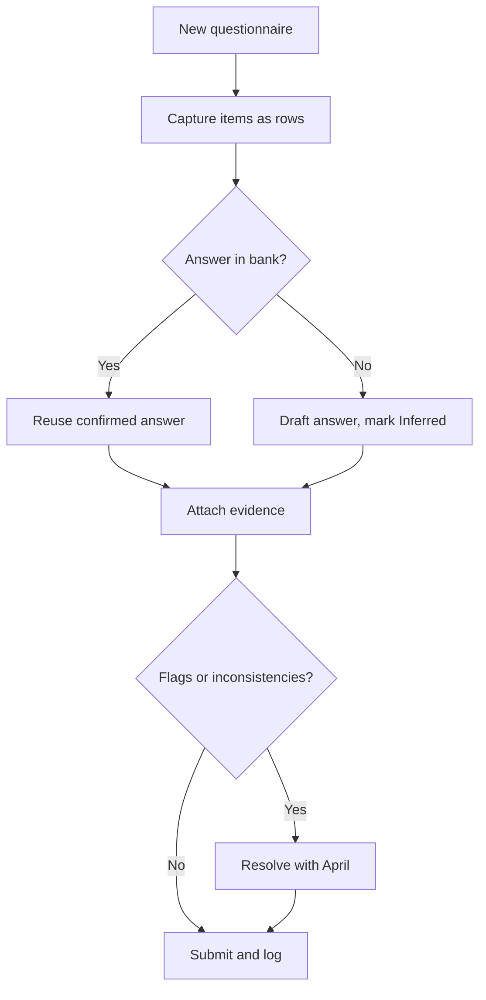

# 📋 Vendor Risk Questionnaire Page Template

> Copied from Notion (april workspace) — source: https://app.notion.com/p/387992e46de080c6ba30f78521466af1
> Parent: The april Almanac. Snapshot as of 2026-07-30.
> This is the page the ecosystem map calls the **Questionnaire Intake / Page Builder Agent**.

# TL;DR

> ⭐ This page is the **standard format** for capturing, answering, and tracking any vendor security or risk questionnaire (Coupa TPM, bank TPRM, SafeBase, CAIQ, SIG).
>
> Capture every item as **one row** in the Answer Bank, tag the **answer type** and **source/confidence**, reuse confirmed answers across surveys, pin every inconsistency or open-item gate in a **🚨 callout**, and attach the exact evidence. Built so the next questionnaire is mostly autofill.

# Vendor Risk Questionnaire Template (AI)

## How to use

1. Create one **Questionnaire entry** per survey and fill the **header callout** (component A): third party, service, source, period, status.
2. Capture every item as a row in the **Answer Bank** (component E schema): Section, Item #, Question (verbatim), Type, Answer, Detail / Mitigation, Attachment, Source / Confidence, Status.
3. **Reuse first.** Before answering, search the Answer Bank for the same or similar question and copy the confirmed answer. Only write net-new answers.
4. Mark anything not directly confirmed as **Inferred** or **Needs review**. Never present an inferred compliance answer as confirmed.
5. Pin cross-survey inconsistencies and open-item gates in a **🚨 callout** (component B). Do not bury them in a cell.
6. Put the answered run on the questionnaire page as a Q&A table (component I) with four reviewer columns to the right of Attachment: **Confidence, What to Confirm, Your response, Comments**. The user reviews and comments inline there, not in a Word doc.

## Page skeleton (mirror the Fifth Third Bank Questionnaire page)

Every questionnaire page has the same shape, top to bottom:

1. **Page header callout** (🏦, gray_bg): third party | legal entity | service and number. Source portal + URL, number of surveys and capture date, page status (in review / submitted).
2. **One `##` section per survey**: heading "\[Third party\]: \[Survey name\]", then the survey header callout (component A), then the Q&A table (component I).
3. **Reviewer follow-up callouts** (component J) directly under the survey table they concern, recording assessor questions and how they were resolved.
4. **Documents** (`## Documents`, bottom of the page): file blocks for every file that entered or left the run: evidence PDFs, the blank questionnaire as received (email attachment or portal export), and the completed workbook or CSV as submitted. Keep original filenames; add a date suffix if the same file goes out twice. The Answer Bank's Document deep links point at these blocks.

The Q&A table lives in **two states**. First pass produces the **review state**: the six answer columns plus four reviewer columns (Confidence with the 0-100 match score, What to Confirm, Your response, Comments) so the user can review inline. After the user confirms, delete the four reviewer columns; the **final state** is the six-column table exactly as on the Fifth Third page.

## Capture rules (don't skip)

- Record the **question text verbatim**. Do not paraphrase the assessor's wording.
- Use the right **answer type**: Yes/No, Single select, Checkbox (check all that apply), Free text, Attachment, Contact.
- Use **Confirmed / Inferred / Needs review** for Source / Confidence, and color the answer accordingly (component C).
- Treat every **"answer No if anything remains open"** gate as **No** unless verified to zero.
- Attach the **exact evidence doc**, and note when one document is reused across questions.
- Store the actual file as a **PDF in the Document (Files & media) property**, added by drag-drop in Notion (the integration cannot upload local files). Keep the filename in **Attachment** for search. Do not attach Word versions.
- Keep core facts consistent across surveys: US-domiciled, Google Cloud hosting, named subprocessors, SOC 1 / SOC 2 / TRUSTe, IRS e-file. A mismatch between two surveys is the fastest way to fail a review.

Source text (paste the raw questionnaire questions here)

Paste the exact items you are answering. Keep the assessor's numbering and wording.

---

## Output format (the Answer Bank schema)

Every questionnaire feeds one shared Answer Bank database, one row per question. This is what the Notion MCP queries to autofill future surveys, so keep it structured, not prose.

See **component E** for the property list.

## Component library

Copy these blocks. They mirror the live questionnaire set (IT Risk, BCM, Pen Test, Data Center, SOC Request, Operational Risk, Cloud, Privacy, Op Risk Service Level, Customer Contact).

### A. Questionnaire header callout

> 🗂️ **\[Survey name + version (period, e.g. vM Onetime, Period Start 28 May 26)\]**
> \[Legal entity\] - \[Service and number\] | Source: \[portal\] | Captured: \[date\] | Reviewer clarifications: \[who, date, if any\] | Submitted: \[date or blank\]

### B. Flag / open-item callout

One issue per callout. purple_bg for a reviewer question, red_bg for an inconsistency or an unanswered required item. Underline the operative word.

> 🚨 \[Item #\] answer **conflicts** with \[other survey / item\]. Reconcile before submit.

### C. Answer-confidence tiers

Color the Answer or Status by how solid it is.

> ✅ **Confirmed**: answered or verified by April, or pulled from a confirmed prior survey

> ⚠️ **Inferred**: drafted from known facts (trust center, prior answers), needs April sign-off

> 🚧 **Needs review / Not answered**: required field blank, or an open gate not yet verified to zero

### D. Toggle for long free-text answers

Hide long narrative answers behind a toggle so the row stays skimmable.

<strong>Answer 13.00: money movement (example)</strong>

- Paste the full narrative answer here.

### E. Answer Bank schema

| **Property** | **Use** |
| --- | --- |
| Customer | Select. The assessing organization (e.g., Fifth Third Bank, Vanguard) |
| Survey | Select. Which questionnaire (IT Risk, BCM, Pen Test, Privacy, Cloud, Operational Risk, Customer Contact, IT / Cyber DDQ, Privacy DDQ, Financial Crime DDQ) |
| Year | Number. The year the questionnaire is submitted |
| Section | Text. Grouping within the survey |
| Item # | Text. The assessor's line-item code from the question (e.g., I.2.9.1, M.4.4), not the spreadsheet serial |
| Question | Title. The question text, verbatim |
| Type | Select. Yes/No, Single select, Checkbox, Free text, Attachment, Contact |
| Answer | Text or Select. Yes, No, Checked, the selected option, or a short value |
| Detail / Mitigation | Text. Narrative, options, or explanation |
| Attachment | Text. Evidence document filename(s), kept for reference and search |
| Document | Files & media. The actual evidence PDF, added by drag-drop in Notion (the integration cannot upload local files) |
| Document 1 | URL. Deep link to the evidence document (e.g., the file block on the questionnaire page) |
| Source / Confidence | Select. Confirmed / Inferred / Needs review |
| Status | Select. Draft / In review / Submitted |

### I. Questionnaire page Q&A table (review state, then final state)

The per-survey table on the questionnaire page. **Review state** (first pass): the six answer columns, then four reviewer columns to the right of Attachment for inline review. These replace the old Word-doc comment pass: the user edits them directly on the page, and the run loads into the Answer Bank only after they confirm. **Final state**: once answers are confirmed, delete the four reviewer columns so the table matches the Fifth Third Bank Questionnaire page exactly (Section, Item, Question, Answer, Detail / Mitigation, Attachment).

| **Column** | **Use** |
| --- | --- |
| Section | Grouping within the survey |
| Item | The assessor's item number, verbatim (the page column is "Item"; the Answer Bank property stays "Item #") |
| Question | The question text, verbatim |
| Answer | Yes, No, the selected option, or a short value |
| Detail / Mitigation | Narrative, options, or explanation |
| Attachment | Evidence document filename(s) |
| Confidence | Tier plus match score, e.g. "Confirmed (95)", "Inferred (72)", "Needs review". Review state only |
| What to Confirm | One-line note on what April must verify (Inferred / Needs review rows only) |
| Your response | The user's decision or answer, entered in bulk during review |
| Comments | Freeform reviewer notes |

### J. Reviewer follow-up callout

One per assessor follow-up, placed directly under the survey table it concerns. Records who asked, what they asked, and where the answer was left.

> 💬 **\[Survey\] reviewer follow-up (\[date\], \[reviewer email\]):** \[what they asked, which items\].
> \[The answer given and where it was left, e.g. a comment on item 5.1 in Coupa.\]

### F. Intake-to-submit flow

### G. Where to get help

> 🆘 **Where to get help**
> - Owner: April Security / Compliance ([security@getapril.com](mailto:security@getapril.com))
> - Evidence documents: April Trust Center ([trust.getapril.com](http://trust.getapril.com))
> - Portal issues: the assessing bank's TPRM contact

### H. Change log

- **Last reviewed:** `YYYY-MM-DD`
- **Owner:** `name`
- **Notes:** what changed and why

---

## Change log

- **Last reviewed:** 2026-07-14
- **Owner:** Erik Leavell
- **Notes:** Initial Questionnaire Template, modeled on the Employee Handbook Template. Built from the Fifth Third / Coupa TPM questionnaire set. Added component I (on-page Q&A table with Confidence / What to Confirm / Your response / Comments reviewer columns), replacing the Word-doc comment pass. 2026-07-14: added the Page skeleton section (page header callout, one section per survey, Documents at bottom) so every run reproduces the Fifth Third page shape; component I now defines review state vs final state with match scores in Confidence; added component J (reviewer follow-up callout); page column renamed Item; component A header now carries Captured / Reviewer clarifications / Submitted.
