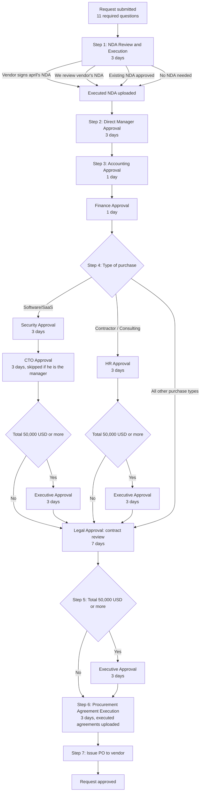

# ✅ Purchase Approval Process & Timelines

> Copied from Notion (april workspace) — source: https://app.notion.com/p/3b6992e46de081a8bf22d496af70e639
> Parent: 🛍️ Procurement Knowledge Base. Order 3. Tag: Policy. Last edited 2026-08-09.

# TL;DR

> ⭐ Every Spend Request runs the same approval chain in Ramp: Legal executes an NDA, then your manager, Accounting, and Finance approve, then extra reviews fire based on what you are buying, then Erik Leavell signs off and a purchase order goes to the vendor. Anything at or above $50,000 adds Executive approval. Legal contract review is the longest step at 7 days. Track your request in Ramp to see where it is sitting.

# april Purchase Approval Process & Timelines

This page describes the live, published Spend Request workflow in Ramp. It is the authority on who approves a purchase and in what order.

> 🚨 All purchase approvals **MUST** run through the Spend Request workflow in Ramp. Approvals granted over email, Slack, or in a meeting do not count.

## The approval chain

The step names below are the ones Ramp shows on your request.

1. **NDA Review & Execution.** Legal approves, 3 day target. Legal takes one of four paths depending on the NDA status you selected: send april's standard NDA to your vendor contact and upload the executed copy, review and sign the vendor-provided NDA and upload the executed copy, review and approve an existing NDA, or confirm no NDA is needed.
2. **Direct Manager Approval.** Your manager approves, 3 day target.
3. **Accounting Approval, then Finance Approval.** Accounting approves first at a 1 day target, then Finance approves at a 1 day target.
4. **Reviews based on purchase type.** See the table below. Software, contractor, and consulting purchases pick up extra reviewers here.
5. **Executive Approval.** Required when the total amount is $50,000 or more. Executive approves, 3 day target.
6. **Procurement Agreement Execution.** Erik Leavell approves, 3 day target, and executed agreements are uploaded at this step.
7. **Issue PO.** The purchase request is approved and a purchase order is issued to the vendor.

## Additional reviews by purchase type

| **Type of purchase** | **Additional reviews, in order** |
| --- | --- |
| Software/SaaS Subscription | Security Approval (3 days), then CTO Approval (3 days), then Executive Approval (3 days) if the total is $50,000 or more, then Legal Approval for contract review (7 days) |
| Contractor / Consulting Services | HR Approval (3 days), then Executive Approval (3 days) if the total is $50,000 or more, then Legal Approval for contract review (7 days) |
| Every other purchase type, including Hardware/Equipment, Events, Office Supplies, Facilities/Maintenance, and IT Infrastructure | Legal Approval for contract review (7 days), and nothing else. No Security, CTO, or HR review fires on any of these, whatever the amount. |

> ⚠️ CTO Approval on software purchases goes to Daniel Marcous, and is skipped when he is already the approving manager on the request.

> 🚨 Any request with a total amount of $50,000 or more **MUST** clear Executive Approval before it can reach the final sign-off and PO steps.

## Target response times

| **Step** | **Approver** | **Target** |
| --- | --- | --- |
| NDA Review & Execution | Legal | 3 days |
| Direct Manager Approval | Manager | 3 days |
| Accounting Approval | Accounting | 1 day |
| Finance Approval | Finance | 1 day |
| Security Approval (software only) | Security | 3 days |
| CTO Approval (software only) | Daniel Marcous | 3 days |
| HR Approval (contractor and consulting only) | HR | 3 days |
| Executive Approval ($50,000 and above) | Executive | 3 days |
| Legal Approval (contract review) | Legal | 7 days |
| Procurement Agreement Execution | Erik Leavell | 3 days |

## Routing

## How long the whole thing takes

A hardware or events request that clears every step on target takes about 15 days. A software purchase at or above $50,000 hits the most reviewers and can run past 25 days. Build that into your contract dates, and file early on renewals.

## Express path for low-risk purchases

> 🚧 This path is agreed in design but **NOT YET LIVE** in Ramp. Everything above this section is what runs today, including for catering and branded merchandise.

Purchases that carry no vendor risk to assess will run four steps instead of six. Qualifying is automatic and computed from your intake answers. The five tests are listed on Requesting a Purchase: Spend Requests.

| **Step** | **Approver** | **Target** |
| --- | --- | --- |
| Direct Manager Approval | Manager | 2 days |
| Finance Approval | Finance | 1 day |
| Legal Approval | Legal | 3 days |
| Issue PO | Automatic | Same day |

The express path drops the NDA step, the Accounting gate, and the final agreement execution step. There is no NDA to execute and no agreement to countersign, so all three are empty motions here.

Legal stays on every express purchase as a general sign-off. A negotiated agreement disqualifies a purchase from this path, so Legal is reading the vendor's standard online terms rather than a contract, which is why the target is 3 days rather than the 7 days a contract review takes. Every purchase that reaches a purchase order has had legal eyes on it, whichever path it took.

> 🚨 Failing any single qualifying test sends the request to the standard chain. Finance can also **RETURN** any express request to the standard chain, and needs no justification to do it.

## Other coming changes

> 🚧 Agreed in design, **NOT YET LIVE** in Ramp. The chain at the top of this page is what runs today.

Three changes land alongside the express path.

- **Accounting moves to the front.** Accounting becomes the first step at a 1 day target, ahead of the NDA step and manager approval, and its job widens from coding to triage. Accounting checks the risk answers on the request, researches the vendor where an answer is missing or unclear, and settles the risk tier. Nothing downstream should branch on an answer nobody has checked.
- **Security review keys off risk, not purchase type.** Today Security fires only on Software/SaaS. It will fire on any Tier 1 or Tier 2 vendor whatever the category, so a services or infrastructure vendor touching april data gets the same scrutiny a software vendor does.
- **The intake asks about risk.** New questions cover what april data the vendor touches, what access it needs, whether it moves funds or sits on the product critical path, and whether it requires a signed agreement. Those answers set the tier, which sets the path.

> 🚨 Owner of the tier rules: Erik Leavell. Any change to the tier tests, the express gates, or the $10,000 ceiling **REQUIRES** that owner's sign-off, because those rules change who reviews a purchase.

> 🆘 **Where to get help**
> - A request stuck on a step: Finance.
> - NDA or contract review questions: Legal.
> - Security review questions on a software purchase: Security.
> - Contractor classification questions: HR.

## Change log

- **Last reviewed:** 2026-08-09
- **Owner:** Erik Leavell
- **Notes:** Express path and Other coming changes sections added 2026-08-09, agreed in design and not yet built in Ramp. Decisions recorded that day: Tier 3 skips Security but keeps Legal as a general sign-off on every purchase; Accounting moves to the front of the standard chain as a triage step and resolves any Unknown risk answers; the express ceiling is $10,000; access means access to systems, networks, or data, so physical presence alone does not disqualify a purchase; Erik Leavell owns the tier rules. Page otherwise transcribed from the published "1. Spend Request" workflow in Ramp. Step names match the approval chain Ramp displays on a submitted request, verified on 2026-08-09 against the Zoom, Juicebox, NYC Intercom, and CustomInk requests. That check also confirmed Security Approval and CTO Approval fire only on software and SaaS purchases, at any dollar amount, and that all non-software purchases run the same six-step chain. This workflow supersedes the approval tables in the Spend Policy, which list $0-499, $500-24,999, $25,000-99,999, and $100,000+ tiers and a Manager, Finance, Legal ordering. Where the two disagree, the Ramp workflow governs. The Spend Policy's review-stage target times (Manager 2 days, Finance 3 days, Legal 5 days, Security 4 days, HR 3 days) are also superseded by the targets in the table above.
